# BentWookie v0.4.0 - Demo Walkthrough

This document walks through all user-facing features of BentWookie using a small demo project: **Todo REST API**. The demo is performed twice:

1. **Part 1: CLI** - All commands via `bw` CLI
2. **Part 2: Web UI** - Same workflow via browser (Playwright-verified)

---

## Part 1: CLI Walkthrough

### 1.1 Initialize Workspace

```bash
$ bw init
BentWookie workspace initialized.
  Data dir:  /private/tmp/bw-demo-clean/data
  Database:  data/bentwookie.db
  Settings:  data/settings.json
  Prompts:   data/prompts
```

Creates the `data/` directory with:
- `bentwookie.db` — SQLite database
- `settings.json` — Configuration file
- `prompts/` — Editable prompt templates
- `docs/` — Document storage

### 1.2 Check System Status

```bash
$ bw system status
BentWookie System Status
========================================
Orchestrator: Stopped

Projects: 0
Active Agents: 0
Idle Agents: 0
Error Agents: 0
Pending Messages: 0

Model: claude-opus-4-5
Max Agents: 5
```

### 1.3 View Configuration

```bash
$ bw system config
Current configuration:
  auth_mode: max
  model: claude-opus-4-5
  max_turns: 50
  poll_interval: 30
  loop_paused: False
  max_iterations: 0
  doc_retention_days: 30
  commit_enabled: True
  commit_branch_mode: current
  commit_branch_name: None
  web_host: 127.0.0.1
  web_port: 5000
  max_concurrent_agents: 5
  agent_timeout: 30
  define_timeout: 30
  design_timeout: 120
  validate_timeout: 60
  build_timeout: 240
  voice_enabled: True
  sse_enabled: True
  max_enterprise_architect: 1
  max_business_architect: 1
  max_service_engineer: 5
  max_coding_agent: 10
  max_testing_agent: 5
  safe_word: KAMILI
  max_task_retries: 3
  orchestrator_poll_interval: 2
```

### 1.4 Create a Project

```bash
$ bw project create "Todo REST API" \
    --desc "A simple REST API for managing todo items with categories and due dates" \
    --codedir "/tmp/todo-api" \
    --max-agents 3
Project created: Todo REST API (ID: 1)
```

### 1.5 List Projects

```bash
$ bw project list
  ID  Name                            Phase         Updated
----------------------------------------------------------------------
   1  Todo REST API                   Define        2026-02-08 15:37:52
```

### 1.6 Show Project Details

```bash
$ bw project show 1
Project: Todo REST API (ID: 1)
  Phase: Define
  Description: A simple REST API for managing todo items with categories and due dates
  Code Dir: /tmp/todo-api
  Model: Default
  Max Agents: 3
  Components: 0
  Agents: 0
```

### 1.7 Edit a Project

```bash
$ bw project edit 1 --name "Todo REST API v2"
Project updated.
```

### 1.8 Start Interviews

Interviews are the first step in the Define phase. Two interviews are needed: Business Owner (goals/requirements) and Enterprise Architect (technical design).

```bash
$ bw interview start 1 --type business_owner
Interview started (ID: 1)
  Project: Todo REST API
  Type: Business Owner
  Open in browser: bw web start, then navigate to /interviews/1

$ bw interview start 1 --type enterprise_architect
Interview started (ID: 2)
  Project: Todo REST API
  Type: Enterprise Architect
  Open in browser: bw web start, then navigate to /interviews/2
```

### 1.9 List Interviews

```bash
$ bw interview list
  ID  Project               Type                       Status      Messages
--------------------------------------------------------------------------------
   2  Todo REST API         Enterprise Architect       pending     0
   1  Todo REST API         Business Owner             pending     0
```

### 1.10 Show Interview Transcript

```bash
$ bw interview show 1
Interview 1: Business Owner
  Project: Todo REST API
  Status: pending
```

(No messages yet - interviews are conducted via the Web UI chat interface)

### 1.11 View Component Hierarchy

After components are created (via Web UI or API during the Design phase):

```bash
$ bw hierarchy show 1
[Service] API Gateway (Draft)
  [Component] Auth Middleware (Draft)
  [Component] Route Handler (Draft)
[Service] Database Layer (Draft)
  [Component] Query Builder (Draft)
  [Component] Schema Manager (Draft)
[Service] Todo Service (Draft)
  [Component] Category Manager (Draft)
  [Component] Todo CRUD (Draft)
    [Function] create_todo() (Draft)
    [Function] delete_todo() (Draft)
    [Function] list_todos() (Draft)
    [Function] update_todo() (Draft)
```

### 1.12 Hierarchy Tree View

```bash
$ bw hierarchy tree 1
API Gateway
  +-Auth Middleware
  +-Route Handler
Database Layer
  +-Query Builder
  +-Schema Manager
Todo Service
  +-Category Manager
  +-Todo CRUD
    +-create_todo()
    +-delete_todo()
    +-list_todos()
    +-update_todo()
```

### 1.13 Component Details

```bash
$ bw component show 6
Component: Todo CRUD (ID: 6)
  Level: Component
  Status: Draft
  Description: Create, read, update, delete operations for todo items
  Children (4):
    - create_todo() [function]
    - delete_todo() [function]
    - list_todos() [function]
    - update_todo() [function]
```

### 1.14 Agent Management

```bash
$ bw agent list
  ID  Role                       Status        Project               Component
-------------------------------------------------------------------------------------
   1  Enterprise Architect       Idle          Todo REST API         N/A
   2  Service Engineer           Idle          Todo REST API         Todo Service
   3  Coding Agent               Idle          Todo REST API         Todo CRUD

$ bw agent show 3
Agent 3: Coding Agent
  Status: Idle
  Project: Todo REST API
  Component: Todo CRUD
  Model: claude-sonnet-4-5-20250929
  Shell PID: N/A
  Started: 2026-02-08 07:41:15.744890
```

### 1.15 Inter-Agent Messaging

```bash
$ bw message send 1 "Please review the Todo CRUD component spec"
Message sent (ID: 1)

$ bw message send 3 "STOP: Spec change for create_todo" --urgent
Message sent (ID: 2)

$ bw message list
  ID  From             To               Type      Status      Body
--------------------------------------------------------------------------------
   2  System           CA-CRUD-1        urgent    queued      STOP: Spec change for create_todo
   1  System           EA-1             normal    queued      Please review the Todo CRUD component sp
```

### 1.16 Build Status

```bash
$ bw build status 1
Build Progress (Project 1):
  Total tasks: 0
  Complete: 0
  In Progress: 0
  Pending: 0
  Blocked: 0
  Errors: 0
```

### 1.17 Task Queue (via REST API)

The task queue is the central work coordination system. Tasks are managed via the REST API.

#### Enqueue Tasks

```bash
# Enqueue a coding task (priority 3, workflow step 21)
$ curl -s -X POST http://127.0.0.1:5199/api/task-queue \
    -H "Content-Type: application/json" \
    -d '{
      "prjid": 1,
      "agent_type": "coding_agent",
      "instructions": "Implement the create_todo() function per the component specification.",
      "component_id": 10,
      "priority": 3,
      "workflow_step": 21
    }'
{"tqid": 1}

# Enqueue a service engineer task (priority 1 = highest)
$ curl -s -X POST http://127.0.0.1:5199/api/task-queue \
    -H "Content-Type: application/json" \
    -d '{
      "prjid": 1,
      "agent_type": "service_engineer",
      "instructions": "Set up the project scaffolding for the Todo Service.",
      "component_id": 2,
      "priority": 1,
      "workflow_step": 15
    }'
{"tqid": 2}

# Enqueue a collaboration request
$ curl -s -X POST http://127.0.0.1:5199/api/task-queue \
    -H "Content-Type: application/json" \
    -d '{
      "prjid": 1,
      "agent_type": "enterprise_architect",
      "instructions": "Review the API Gateway auth middleware design.",
      "request_type": "collab",
      "priority": 2
    }'
{"tqid": 3}
```

#### List Tasks (ordered by priority)

```bash
$ curl -s "http://127.0.0.1:5199/api/task-queue?prjid=1" | python3 -m json.tool
[
    {
        "tqid": 2,
        "tqagent_type": "service_engineer",
        "tqpriority": 1,
        "tqstatus": "pending",
        "tqworkflow_step": 15,
        "tqinstructions": "Set up the project scaffolding for the Todo Service.",
        ...
    },
    {
        "tqid": 3,
        "tqagent_type": "enterprise_architect",
        "tqpriority": 2,
        "tqstatus": "pending",
        "tqrequest_type": "collab",
        ...
    },
    {
        "tqid": 1,
        "tqagent_type": "coding_agent",
        "tqpriority": 3,
        "tqstatus": "pending",
        "tqworkflow_step": 21,
        ...
    }
]
```

#### Get Task Details

```bash
$ curl -s "http://127.0.0.1:5199/api/task-queue/1" | python3 -m json.tool
{
    "tqid": 1,
    "tqagent_type": "coding_agent",
    "tqstatus": "pending",
    "tqpriority": 3,
    "tqworkflow_step": 21,
    "tqrequest_type": "task",
    "tqretry_count": 0,
    "tqmax_retries": 3,
    "tqinstructions": "Implement the create_todo() function...",
    ...
}
```

#### Cancel a Task

```bash
$ curl -s -X POST "http://127.0.0.1:5199/api/task-queue/3/cancel"
{"status": "ok", "tqid": 3}
```

#### Queue Statistics

```bash
$ curl -s "http://127.0.0.1:5199/api/task-queue/stats/1" | python3 -m json.tool
{
    "total": 3,
    "pending": 2,
    "in_progress": 0,
    "complete": 0,
    "failed": 0,
    "cancelled": 1,
    "expired": 0,
    "avg_duration_secs": 0.0,
    "counts": {"pending": 3}
}
```

#### Project Progress

```bash
$ curl -s "http://127.0.0.1:5199/api/projects/1/progress" | python3 -m json.tool
{
    "percent": 0,
    "current_step": 0,
    "total_steps": 27,
    "tasks": {
        "total": 3,
        "complete": 0,
        "failed": 0,
        "in_progress": 0,
        "pending": 2
    }
}
```

#### Performance Stats

```bash
$ curl -s "http://127.0.0.1:5199/api/projects/1/performance" | python3 -m json.tool
{
    "total_tasks": 3,
    "completed_tasks": 0,
    "failed_tasks": 0,
    "avg_duration_secs": 0.0
}
```

#### Filter by Status

```bash
$ curl -s "http://127.0.0.1:5199/api/task-queue?prjid=1&status=cancelled"
[{"tqid": 3, "tqstatus": "cancelled", "tqrequest_type": "collab", ...}]
```

### 1.18 Final System Status

```bash
$ bw system status
BentWookie System Status
========================================
Orchestrator: Stopped

Projects: 1
Active Agents: 0
Idle Agents: 3
Error Agents: 0
Pending Messages: 2

Model: claude-opus-4-5
Max Agents: 5
```

### 1.19 Version Check

```bash
$ bw --version
BentWookie, version 0.4.0
```

---

## Part 2: Web UI Walkthrough (Playwright-Verified)

All screenshots below were captured via Playwright browser automation against a live BentWookie instance with the same demo project from Part 1.

```bash
$ bw web start --port 5199
Starting BentWookie web UI at http://127.0.0.1:5199
```

### 2.1 Dashboard (`/`)

The Mission Control dashboard shows project counts, agent activity, queued messages, urgent alerts, and orchestrator status at a glance. The subheader bar shows per-role agent counts with quick-spawn (+) buttons.

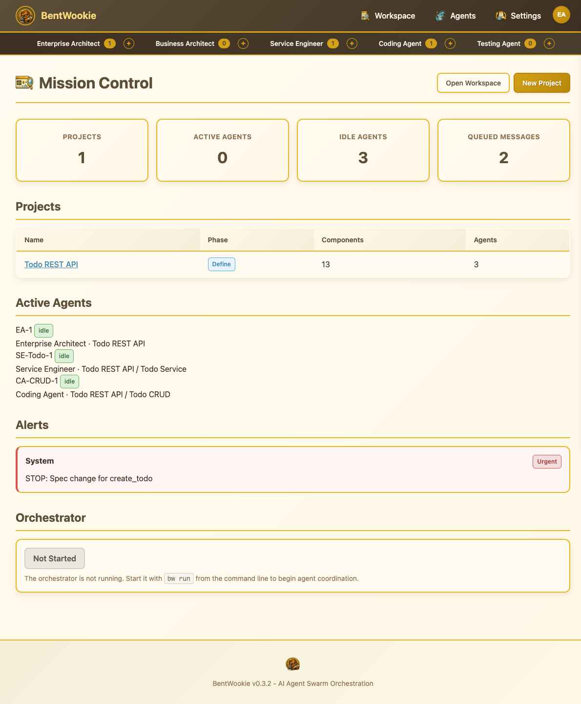

### 2.2 Projects List (`/projects`)

Lists all projects with phase badges, component counts, progress bars, and Edit/Delete actions. Includes a phase filter dropdown and name search.

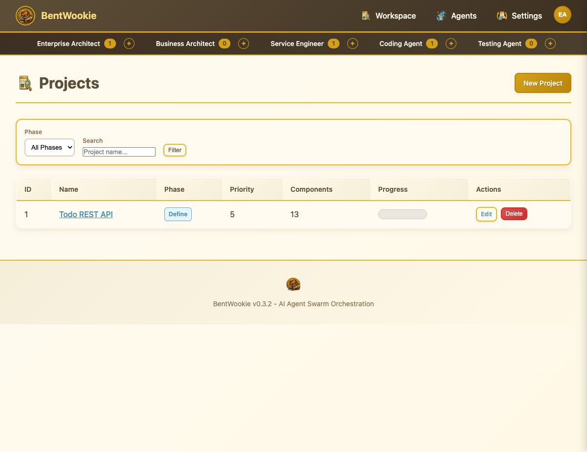

### 2.3 New Project Form (`/projects/new`)

Streamlined project creation: name, code directory (with Browse picker), and a "Start Interview" button that creates the project and launches the first interview in one step.

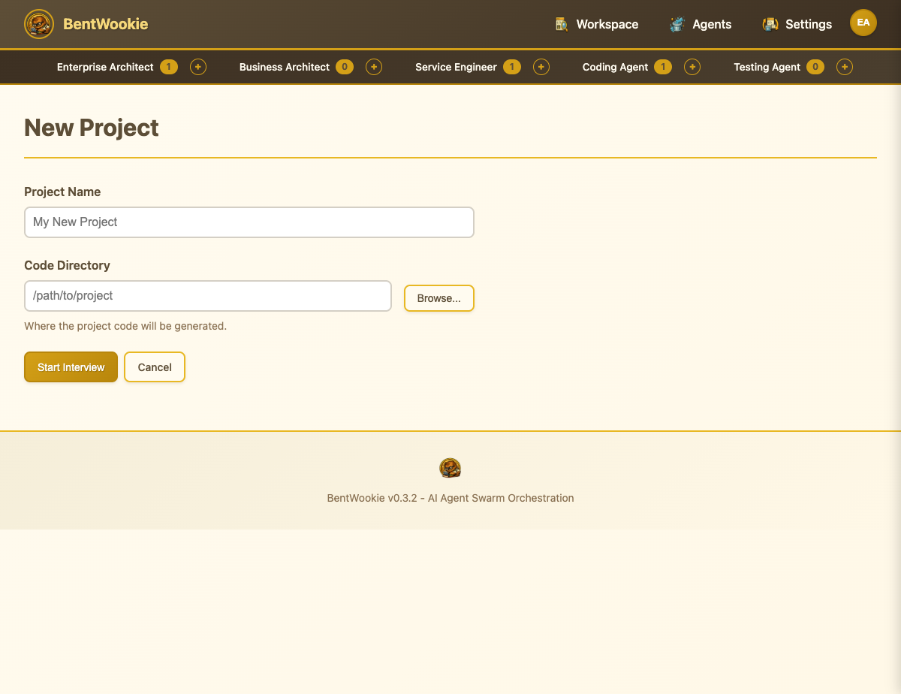

### 2.4 Project View (`/projects/<id>`)

Detailed project page with metadata (phase, description, code directory), tabbed sections (Hierarchy, Dependency Graph, Test Specs, Documents), and expandable service rows showing component counts and completion percentages.

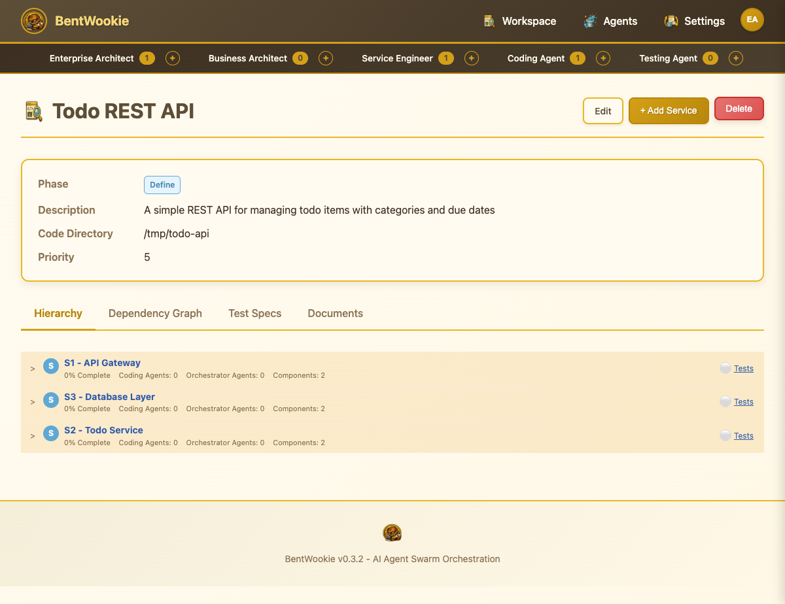

### 2.5 Workspace (`/workspace/<id>`)

Split-panel layout: left panel shows the full hierarchy tree (Services > Components > Functions) with expand/collapse and status badges. Right panel shows the selected item's attributes, progress bar, and action buttons (Edit, Full View, Start Interview).

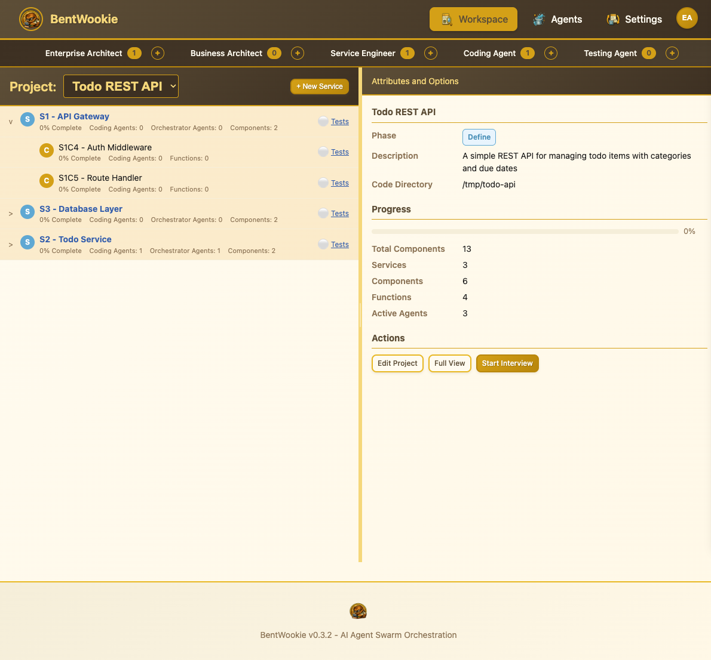

### 2.6 Agent Swarm (`/agents`)

Real-time agent monitoring with a collapsible tree grouped by role. Each agent shows its name, status indicator (green=idle), and assigned component. The right panel displays summary stats (Active/Idle/Error/Queued) and the message queue log showing urgent and normal messages.

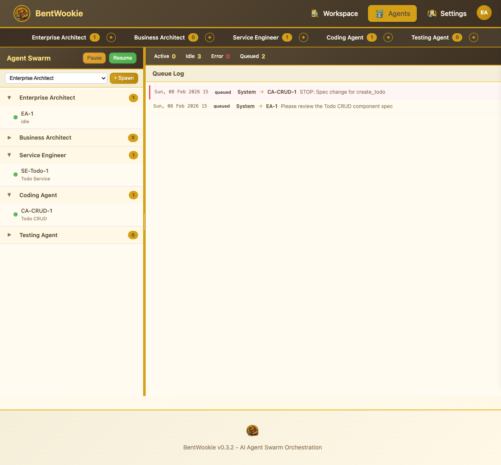

### 2.7 Interviews List (`/interviews`)

Lists all interviews with project link, type badge (Business Owner / Enterprise Architect), status, message count, and a "Start" button to open the chat session.

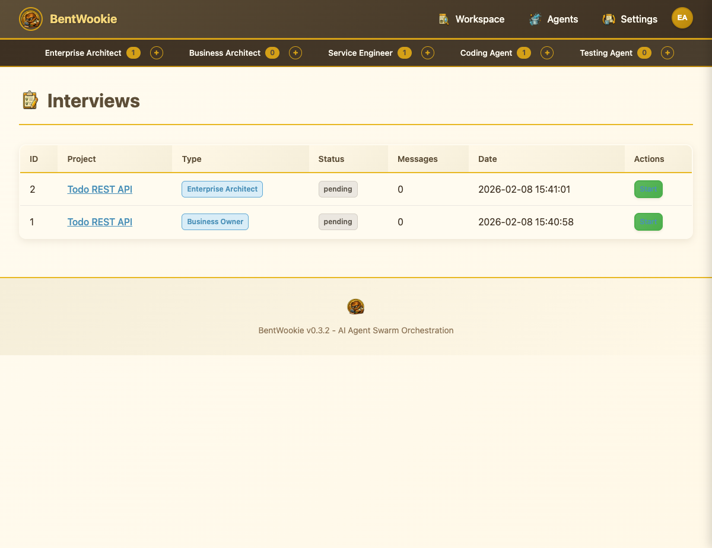

### 2.8 Interview Chat (`/interviews/<id>`)

Full-screen chat interface for conducting interviews. Includes a scrollable transcript area, text input, voice input button, and Send button. Status badge and project link in the header.

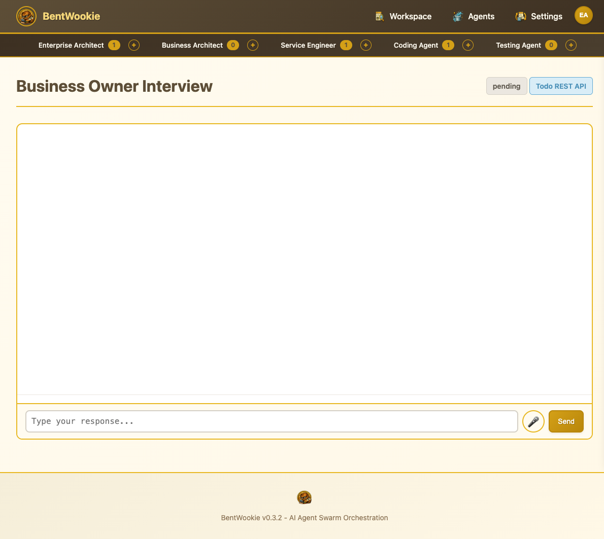

### 2.9 Settings (`/settings`)

Comprehensive configuration: Claude SDK model selection, agent limits and timeouts, web server host/port, feature toggles (voice, SSE), and per-role model overrides (Enterprise Architect, Business Architect, Service Engineer, Coding Agent, Testing Agent).

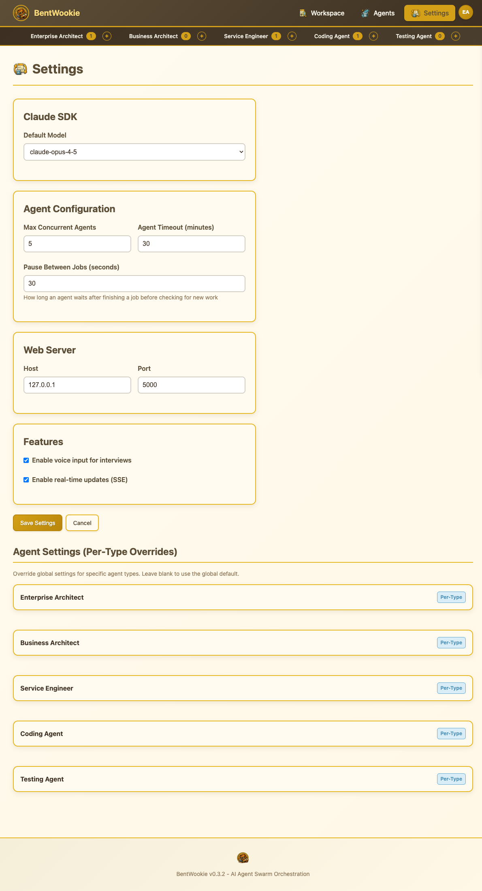

### 2.10 Component Detail (`/components/<id>`)

Breadcrumb navigation (Projects > Service > Component), status badge, metadata (level, status, description), children table with linked function names, and side panels for Test Specs, Connections, and Dependencies.

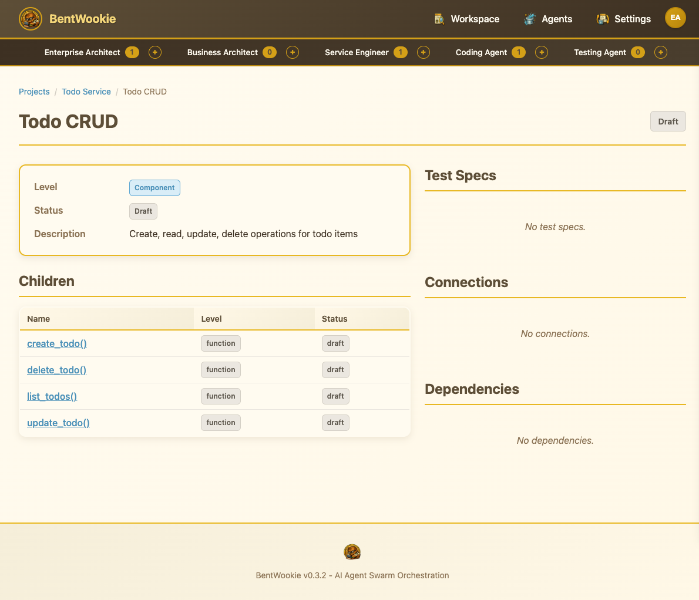

### 2.11 Messages (`/messages`)

Message log with type/status filters. Each message card shows sender/recipient, type badge (urgent=red, normal=blue), delivery status, message body, and timestamp.

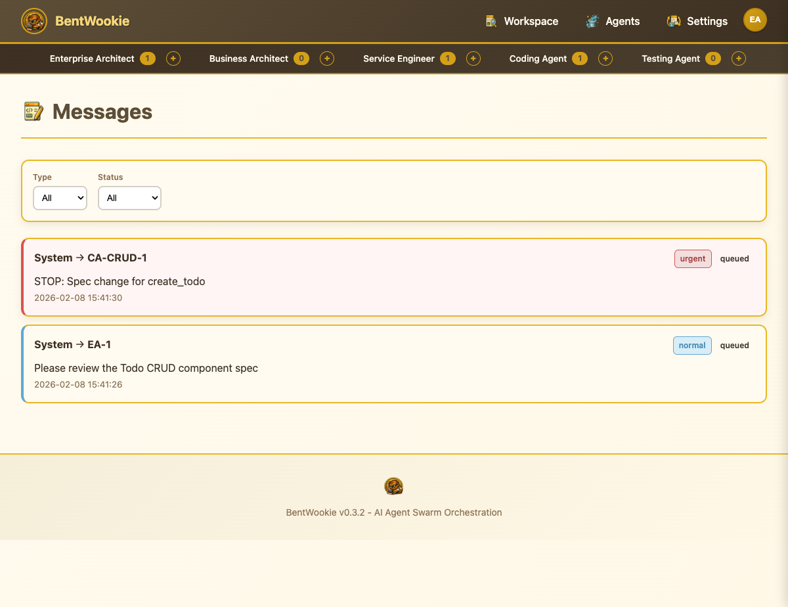

### 2.12 System (`/system`)

Orchestrator status with Pause/Resume controls, system statistics (projects, agents, messages), and inline configuration for model, agent limits, timeout, and poll interval.

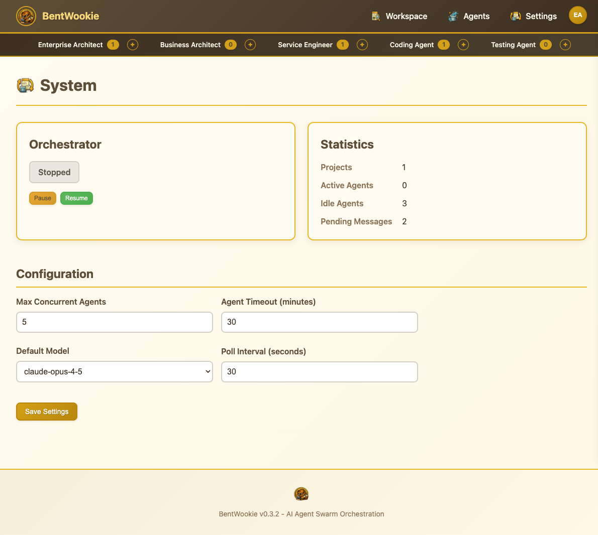

### 2.13 Health Endpoint

```bash
$ curl http://127.0.0.1:5199/health
{"service":"bentwookie","status":"ok","version":"0.4.0"}
```

### 2.14 SSE Event Stream (`/api/events`)

Server-Sent Events for real-time updates:
- `agent_status` — Agent status changes
- `message_new` — New messages
- `task_queued` — Task added to queue
- `task_assigned` — Task picked up by agent
- `task_complete` — Task finished
- `task_failed` — Task errored
- `progress_update` — Build progress change
- `heartbeat` — Keep-alive every 15s

---

## API Reference (Quick)

| Method | Endpoint | Description |
|--------|----------|-------------|
| GET | `/health` | Service health check |
| GET | `/api/projects` | List projects |
| POST | `/api/projects` | Create project |
| GET | `/api/projects/<id>` | Project details |
| GET | `/api/projects/<id>/hierarchy` | Component tree |
| GET | `/api/projects/<id>/progress` | Build progress % |
| GET | `/api/projects/<id>/performance` | Timing stats |
| POST | `/api/projects/<id>/services` | Add service component |
| GET | `/api/agents` | List agents |
| GET | `/api/agents/<id>` | Agent details |
| POST | `/api/agents/<id>/spawn` | Spawn agent |
| POST | `/api/agents/<id>/terminate` | Terminate agent |
| GET | `/api/task-queue` | List tasks (filterable) |
| POST | `/api/task-queue` | Enqueue task |
| GET | `/api/task-queue/<id>` | Task details |
| POST | `/api/task-queue/<id>/cancel` | Cancel task |
| GET | `/api/task-queue/stats/<prjid>` | Queue statistics |
| GET | `/api/interviews` | List interviews |
| POST | `/api/interviews/<id>/messages` | Send interview message |
| GET | `/api/messages` | List messages |
| GET | `/api/events` | SSE event stream |

---

## Workflow Overview (27 Steps)

| Phase | Steps | Agent | Description |
|-------|-------|-------|-------------|
| Design | 1-2 | BA | Business Owner & EA interviews |
| Design | 3-5 | EA | Service design, component decomposition |
| Design | 6-8 | EA | Connection maps, data models |
| Design | 9-11 | EA | Test spec generation |
| Design | 12-14 | EA | Build plan, dependency graph |
| Build Services | 15-17 | SE | Project scaffolding, OSS setup |
| Build Services | 18-20 | SE | Service integration, CI/CD |
| Build Code | 21-22 | CA | Component implementation + tests |
| Build Code | 23-24 | CA | Integration, dedup, assembly |
| Completion | 25-26 | TA | Full test suite, validation |
| Completion | 27 | EA | Final review and sign-off |
